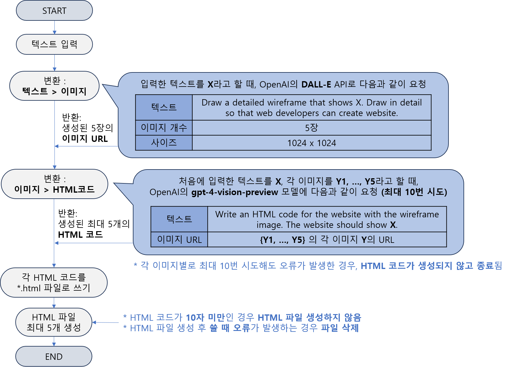
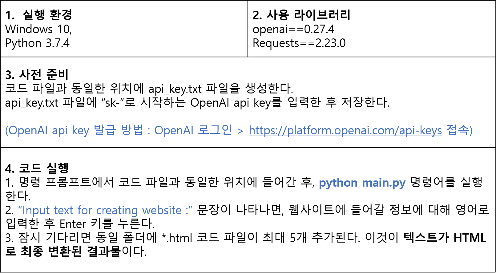

# Text_to_website_Nov_2023
current version : **v1.1**

## 실행 순서도


## 실행 및 테스트 방법


* API KEY 링크 : [바로가기](https://platform.openai.com/api-keys)

## 버전 관리
### v1.1
* 2023.11.28 12:10 (KST)
* 버그 수정 및 안정성 개선

### v1.0
* 2023.11.27 17:40 (KST)
* 버그 수정 및 안정성 개선

### v0.2
* 2023.11.27 15:45 (KST)
* 버그 수정 및 안정성 개선

### v0.1
* 2023.11.26 00:15 (KST)
* 텍스트 -> 이미지 -> 웹사이트 코드 HTML 파일 생성 기본 기능 구현

## branch
|branch|version|status|description|
|---|---|---|---|
|dev-001|v0.1|```완료```|텍스트 -> 이미지 -> 웹사이트 코드 변환 기본 구현|
|dev-002|v0.2|```완료```|DALL-E, GPT-4 프롬프트 수정|
|dev-003|v0.2|```완료```|오류 처리 로직 추가 (exception handling)|
|dev-004|v1.0|```완료```|GPT-4, 파일 쓰기 오류 등 처리 로직 추가|
|dev-005|v1.1|```완료```|코딩 컨벤션 수정 등|